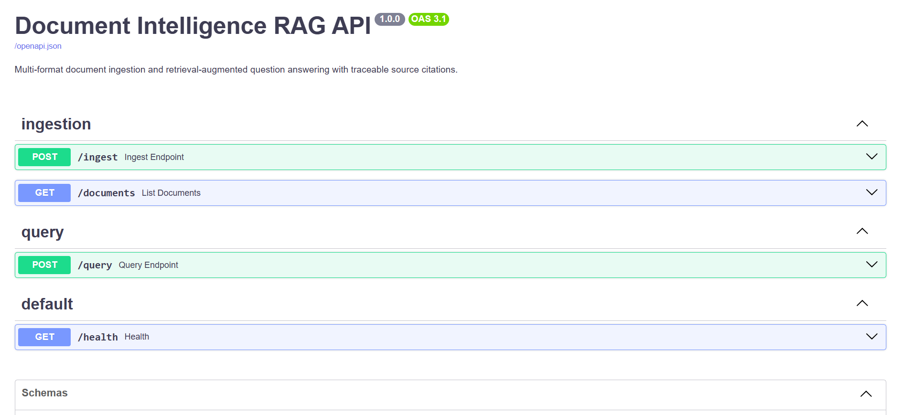

# Document Intelligence RAG System

A retrieval-augmented question-answering system for internal documents (SOPs, regulations, audit logs, training materials) across mixed formats. Every answer traces back to an exact source location — file name, page, slide, sheet, or row range.

## What it does

You have a folder of PDFs, Word docs, slide decks, spreadsheets, and CSVs. You ask a question in plain language. The system finds the relevant passages across all of them and answers with citations you can verify, e.g.:

> "Audits are conducted weekly, every Monday at 08:00 [S1]. Unscheduled audits may be triggered by a customer complaint or NCR [S1]."
> — Source: `sop_quality_audit_production_line.pdf`, page 1

## Demo Video

[**Watch the full demo on YouTube**](https://youtu.be/q-2hzIoY6C8) — covers ingestion across all 5 supported formats and 3 example queries with verified citations (PDF, DOCX, and XLSX sources).

### Interactive API docs (Swagger UI)



FastAPI auto-generates this interactive documentation at `http://localhost:8000/docs` once the stack is running — useful for trying `/ingest` and `/query` directly in the browser without `curl` or PowerShell.

## Architecture at a glance

```
File upload --> Format detection --> Extractor --> Structure-aware chunker
                                                          |
                                                          v
                                          Local embedding model (multilingual-e5-base)
                                                          |
                                                          v
                                               Postgres + pgvector
                                                          |
                                  Query --> embed --> similarity search --> Groq LLM --> cited answer
```

See [TECHNICAL.md](TECHNICAL.md) for the full architecture writeup, chunking strategy, and design trade-offs.

## Supported formats

| Format | Citation granularity |
|---|---|
| PDF | page number |
| DOCX | section (by heading) / table |
| PPTX | slide number (+ speaker notes) |
| XLSX | sheet name + row range |
| CSV | row range |
| TXT | character block index |

## Setup

### Requirements
- Docker and Docker Compose
- A free [Groq API key](https://console.groq.com)

### 1. Clone and configure

```bash
git clone <repo-url>
cd doc-intel-rag
cp .env.example .env
# edit .env and set GROQ_API_KEY
```

### 2. Start the stack

```bash
docker compose up --build
```

This starts Postgres with the pgvector extension and the FastAPI app on `http://localhost:8000`. The database schema is created automatically on first startup.

### 3. Ingest the sample corpus

The repo ships with 10 sample documents (2 each: PDF, DOCX, PPTX, XLSX, CSV) under `data/corpus/`. From inside the running container:

```bash
docker compose exec api python scripts/ingest_corpus.py
```

Or ingest files one at a time via the API (see below) — useful for adding your own documents without rebuilding the corpus.

### 4. Ask questions

```bash
curl -X POST http://localhost:8000/query \
  -H "Content-Type: application/json" \
  -d '{"question": "What is the procedure for a quality audit on Production Line B?"}'
```

Interactive API docs are available at `http://localhost:8000/docs`.

## Running locally without Docker

```bash
python -m venv venv
source venv/bin/activate  # Windows: venv\Scripts\activate
pip install torch --index-url https://download.pytorch.org/whl/cpu  # CPU-only, skips ~1.5GB of unused CUDA libs
pip install -r requirements.txt

# Start your own Postgres with the pgvector extension, then:
cp .env.example .env  # set DATABASE_URL and GROQ_API_KEY

python scripts/ingest_corpus.py
uvicorn app.main:app --reload
```

## API reference

### `POST /ingest`
Upload and index a single document.

```bash
curl -X POST http://localhost:8000/ingest \
  -F "file=@data/corpus/sop_quality_audit_production_line.pdf"
```

Response:
```json
{
  "file_name": "sop_quality_audit_production_line.pdf",
  "segments_extracted": 2,
  "chunks_indexed": 3
}
```

### `GET /documents`
List all indexed files and total chunk count.

### `POST /query`
Ask a question.

```json
{
  "question": "What happens if a batch fails the dimensional checklist?",
  "top_k": 5,
  "source_file": null
}
```

`top_k` and `source_file` are optional — omit `source_file` to search across the whole corpus, or set it to scope the search to one document.

## Observability (optional)

Every query is traced with [Langfuse](https://langfuse.com) — a root span for the request, a child span for retrieval (which chunks were pulled and from where), and a generation span for the Groq call. To enable it, set `LANGFUSE_PUBLIC_KEY` and `LANGFUSE_SECRET_KEY` in `.env` (free account at [cloud.langfuse.com](https://cloud.langfuse.com)). Without these set, tracing is a no-op and the system behaves identically.

## Example Q&A (against the sample corpus)

The answers below illustrate the expected output shape — grounded in the sample corpus content and citation format — based on what the retrieval and prompt are designed to produce. Exact LLM phrasing will vary slightly between runs.

**Q: What is the procedure for a quality audit on Production Line B?**
> The audit follows five steps: verify the production log against the master schedule, inspect a random sample of 15 units against the dimensional checklist QA-FORM-09 (rejecting the batch if more than 2 fail), check operator safety certifications, check tool calibration stickers, and document findings in QA-FORM-11 within 4 hours [S1].
> — `sop_quality_audit_production_line.pdf`, page 1

**Q: What is the response time requirement for a Severity 1 security incident?**
> A Severity 1 incident requires response within 15 minutes, and the CISO must be notified within 30 minutes, with Legal notified within 2 hours due to potential regulatory disclosure obligations [S1][S2].
> — `sop_incident_response_it_security.docx`, sections "Incident Severity Levels" and "Communication Protocol"

**Q: How many security incidents were reported in Q1 2026, and what severity were they?**
> Three Severity 3 incidents (phishing reports) were reported in Q1 2026, with zero Severity 1 or 2 incidents. Average response time was 1.8 hours against a 4-hour target [S1].
> — `report_quarterly_compliance_review_q1.pptx`, slide 3

**Q: What's the approval threshold for procurement requiring CFO sign-off?**
> Purchases above IDR 50,000,000 require CFO approval and must include at least two competing vendor quotations [S1].
> — `regulation_procurement_approval_policy.docx`, section "Approval Thresholds"

## Running tests

```bash
pip install pytest
pytest tests/ -v
```

Unit tests cover extraction (all 5 formats against the sample corpus) and chunking boundary behavior. They run without a database connection, so they're safe in CI.

## Project structure

```
app/
├── extractors/        # one extractor per format, common RawSegment output
├── router.py           # format detection + dispatch
├── chunking.py          # structure-aware chunker
├── embeddings.py        # local sentence-transformers wrapper
├── vectorstore.py       # Postgres + pgvector schema, insert, similarity search
├── rag_pipeline.py       # retrieval + Groq generation + citation assembly
├── ingestion.py          # orchestrates extract -> chunk -> embed -> store
└── api/
    ├── ingest.py          # POST /ingest, GET /documents
    └── query.py           # POST /query
data/corpus/            # sample documents
scripts/
├── ingest_corpus.py     # batch-ingest data/corpus
└── generate_sample_corpus.py  # regenerates the sample documents (dev tool)
tests/                  # extractor + chunking unit tests
```
